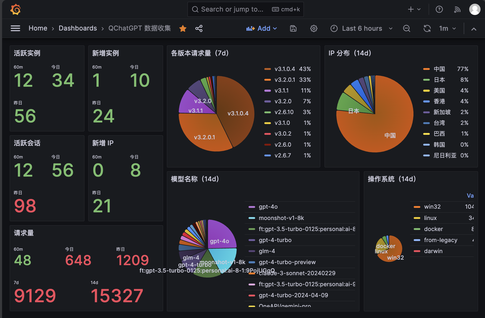

# qcg-center

QChatGPT 项目的中央服务器程序

接口文档见：https://apifox.com/apidoc/shared-6279362c-bd8d-41c1-8244-39e86e3f5b79

## 功能

### 收集遥测数据

收集启动、公告展示、插件安装、程序更新、请求完成、插件事件触发等事件，并保存到 MongoDB 中。

### 为 Grafana 展示数据提供接口

接口文档中展示了获取实时数据等通用接口，可以用 Grafana 的 [JSON API 插件](https://grafana.com/docs/plugins/marcusolsson-json-datasource/latest/)接入数据

### 分发大模型元数据

`assets/llm-models` 目录下的所有文件都讲被加载进内存，客户端在启动时会携带版本号请求 qcg-center 的模型列表。此目录下每个文件都标明了其适配的客户端版本，若客户端传递的版本号不存在于服务端，将返回兼容版本号包含`default`的文件中的llm-models列表。  
llm-models列表格式可以参考：https://qchatgpt.rockchin.top/posts/metadata/llm-models.html